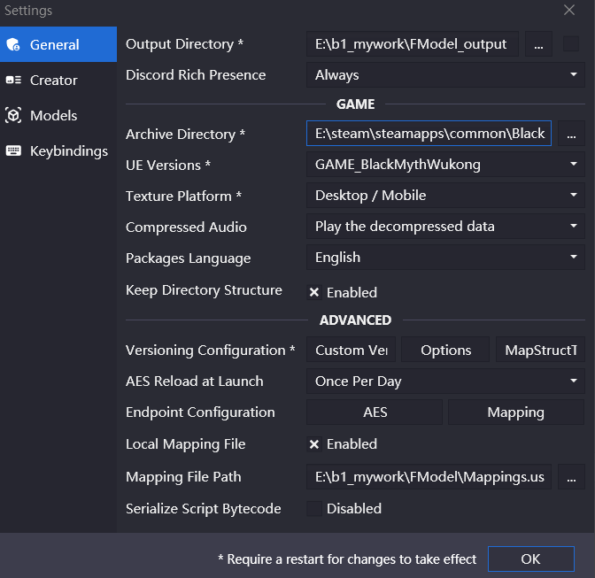
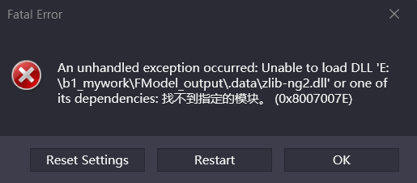
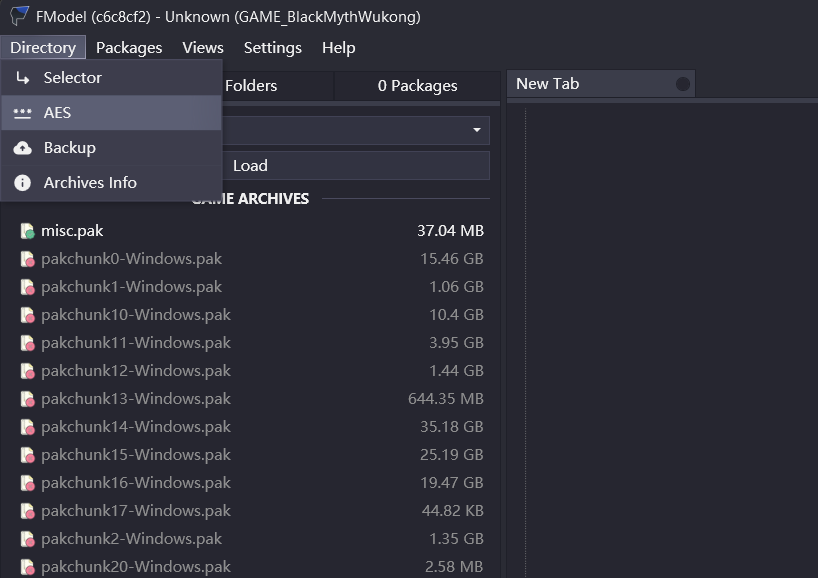

# 关于此文件夹中的内容

# 1. 解包相关 ./FModel/ 
## · （1）用于给 FModel.exe 解包使用的两个前置
    ./FModel/Key.txt  (up主[产奶的黄药师]提供)
    ./FModel/Mappings.usmap 
./Key.txt用到了AES_finder.exe。大概就是把该.exe放到游戏运行路径，然后双击运行就会得到.txt，我直接下载的up主生成的。

./Mappings.usmap是使用DLL_Injector得到的。需要游戏跑起来，然后用DLL_Injector搜索b1-Win64-Shipping.exe并添加一个UnrealMappingsDumper.dll，点击Inject，得到.usmap。
 DLL_Injector下载：https://dllinjector.net/ 

## · （2） FModel.exe
    
    ./FModel/FModel.exe
    ./FModel/Output/

与FModel.exe同级目录下会自动有Output文件夹。但是我会设置解包输出路径为*./FModel_output/*

设置完成以后，会提示出现：

我也下载了up主提供的以下东西：
    ./FModel/解包所需额外/.data/*

用到时需要把这些复制到FModel.exe输出的Output文件下的.data中（默认生成的Output的.data/只有一个oo2core_9_win64.dll）

下图位置粘贴./FModel/Key.txt中的key

PS:在*C:\Users\wdc\AppData\Roaming\FModel* 中会存有配置文件。

# 2. 解包输出 ./FModel_output/

## · （1） 

可能后续还有./FModel_output1/ 、./FModel_output2/啥的。。。。。。

后续设置，主要是记得从 *./FModel/解包所需额外/.data/* 中拿东西。

# 3 ./Wukong_DataEditor/

大佬的配置表编辑器

# 4 反编译.dll软件：ILSpy

使用./ILSpy_Installer_9.0.0.7833-preview3-x64.msi安装反编译.dll软件：ILSpy。

# PS: 
1、还有一篇别人的博客可以参考： https://blog.realduang.com/blogs/others/black-myth-ue5-reverse-engineering.html

2、2024.12更新之后，我自己重新搞了Mappings.usmap，放在./FModel/Mappings.usmap

3、Visual Studio得打开.sln文件！！！

